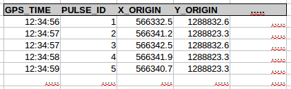
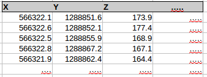
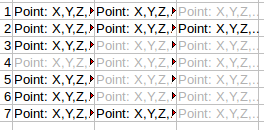
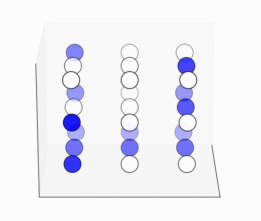

=======================
How to Visualise Arrays
=======================

Data returned from getPulses(). A one dimensional structured array. Each element describes a Pulse:

Data returned from getPoints(). A one dimensional structured array. Each element describes a Point:

Data returned from getPointsByPulses(). A 2 dimensional masked structured array. Each row has the points for a pulse. As some pulses have more points than others, the mask=True for elements that aren't valid for a pulse (greyed out):

Data returned from getPointsByBins()/getPulsesByBins(). A 3 dimensional masked structured array. The X and Y dimensions describe the bins, but each bin has a different number of points/pulses. Clear circles are masked out (mask=True):

