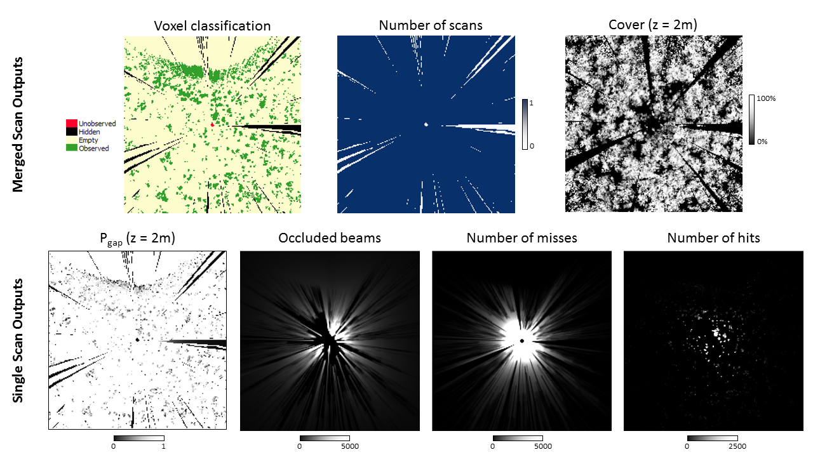

=====================================
Command Line Examples: pylidar_canopy
=====================================

Once you have converted your data to SPDV4 format, you can use this
utility to derive various published lidar canopy metrics. Some metrics will also 
accept other suitable file formats.

--------------------------------
Deriving vertical plant profiles
--------------------------------

*Calders, K., Armston, J., Newnham, G., Herold, M. and Goodwin, N. 2014. Implications of sensor configuration and topography on vertical plant profiles derived from terrestrial LiDAR. Agricultural and forest meteorology, 194: 104--117.*

Single position vertical plant profiles [Pgap(theta,z), PAI(z), PAVD(z)] from 
TLS as described by Calders et al. (2014) Agricultural and Forest 
Meteorology are implemented. These are designed to stratify gap fraction, 
plant area index, and plant area volume density by height when only
single scan locations are measured. RXP and SPD files are accepted as input.

Run "pylidar_canopy -h" to obtain full help. The basic usage is to specify 
1 or 2 (in the case of a RIEGL VZ400) input files like this::

    pylidar_canopy -m PAVD_CALDERS2014 -i tls_scan_upright.spd tls_scan_tilted.spd -o vertical_profiles.csv
        --minzenith 35.0 5.0 --maxzenith 70.0 35.0 --heightcol HEIGHT

    pylidar_canopy -m PAVD_CALDERS2014 -i tls_scan_upright.rxp -o vertical_profiles.csv
        -p -r planefit.rpt --minzenith 35.0 --maxzenith 70.0

    pylidar_canopy -m PAVD_CALDERS2014 -i upright.rxp tilt.rxp -o vertical_profiles.csv 
        --minazimuth 0 0 --maxazimuth 0 0 --minzenith 35.0 5.0 --maxzenith 70.0 35.0 
        --externaltransformfn upright.dat tilt.dat --weighted --planecorrection 
        --reportfile report.rpt --minheight -10 --maxheight 60

The output is a CSV file with a table of vertical profile metrics [Pgap(theta,z), PAI(z), PAVD(z)] 
as columns and vertical height bin (m) starting points as rows. This command can also apply a 
plane fit on-the-fly to correct a single location scan for topographic effects (the -p option) 
and also output a report on the fit statistics (the -r option). If point heights are already 
defined in an SPD file (e.g. from a DEM), specify the point column name to use with --heightcol.

In the above examples, only view zenith angles between 35 and 70 degrees are used for the 
tls_scan_upright.spd file and 5 and 35 degrees for the tls_scan_tilted.spd file. These are 
recommended values for the RIEGL VZ400 (Calders *et al.*, 2014).

----------------------------------------------------
Voxel traversal and deriving vertical cover profiles
----------------------------------------------------

The voxel traversal is a Python implementation (using numba for speed) of the following algorithm:

*Amanatides, J. and Woo, A. 1987. A Fast Voxel Traversal Algorithm for Ray Tracing. Proceedings of EuroGraphics. 87.* 

We account for partial interception of each beam by stepwise reduction of beam weighting with each interception. Each beam starts with a weighting of 1, but this is reduced by 1 / *N* with each interception where *N* is the total number of returns for that beam. The end of each beam is assumed to be the edge of the voxel space. 

The derivation of vertical cover profiles is a simplified implementation of the following method:

*Hancock, S., Anderson, K., Disney, M. and Gaston, K.J. 2017. Measurement of fine-spatial-resolution 3D vegetation structure with airborne waveform lidar: Calibration and validation with voxelised terrestrial lidar. Remote Sensing of Environment, 188: 37--50.*

The simplification is in how we account for partial interceptions in the calculation of voxel Pgap (see above) and derive the vertical cover profiles (1 - Pgap(z)).

An example of deriving voxelized vertical Pgap profiles by combining all registered scans::

    pylidar_canopy -m VOXEL_HANCOCK2016 -i scan1.rxp scan2.rxp scan3.rxp 
        -o nscans.tif cover_profile.tif voxel_class.tif 
        --voxelsize 0.5 --bounds -50 -50 -10 50 50 60 
        --rasterdriver GTiff --externaldem dem.tif 
        --externaltransformfn scan1.dat scan2.dat scan3.dat 

Individual scan products are automatically generated and output:

1. Weighted number of beams that reach the voxel unoccluded and have an interception in that voxel (hits)
2. Weighted number of beams that pass through the voxel unoccluded (miss)
3. Weighted number of beams that are occluded from the voxel (occl)
4. Directional gap probability (pgap) calculated as miss / (miss+hits)

To get the vertical cover for a voxel 1-pgap is averaged across all scans (assuming all intercepted elements have the same projected area at different view angles), with each scan weighted by (miss + hits) / (miss + hits + occl) to account for then visibility of that voxel. The vertical profile of cover is calculated by conditional probability, so assuming a random distribution of elements in each voxel.

Three merged scan output files are generated and output as specified by the --output command line argument:

1. Number of scans that a voxel is visible to (nscans.tif)
2. Vertical cover profile (cover_profile.tif)
3. Voxel classification. The following table shows the classification codes:
   
   +-------------+-------+------+--------+----------+ 
   | Class       | Value | Hits | Misses | Occluded |
   +=============+=======+======+========+==========+ 
   | Observed    | 5     | >0   | >=0    | >=0      |
   +-------------+-------+------+--------+----------+ 
   | Empty       | 4     | =0   | >0     | >=0      |
   +-------------+-------+------+--------+----------+ 
   | Hidden      | 3     | =0   | =0     | >0       |
   +-------------+-------+------+--------+----------+ 
   | Unobserved  | 2     | =0   | =0     | =0       |
   +-------------+-------+------+--------+----------+ 
   | Ground      | 1     |      |        |          |
   +-------------+-------+------+--------+----------+ 

Below is an example of a horizontal slice of a 0.5 m voxelization output from pylidar_canopy using a single scan as input. The command line syntax for this example was::

pylidar_canopy -m VOXEL_HANCOCK2016 -i 151125_121744.rxp 
    -o nscans.tif cover_profile.tif voxel_class.tif 
    --voxelsize 0.5 --bounds -50 -50 -10 50 50 60 
    --rasterdriver GTiff

For ease of interpretation we only show a the output using a single scan. The horizontal slice is taken at 2m because this is the height of the scanner so beams will traverse the voxel space horizontally, further simplifying visual interpretation.

