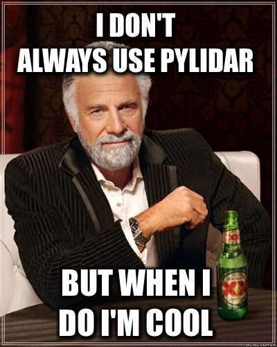

..  _contents:

PyLidar
===================================

Introduction
------------

A set of Python modules which makes it easy to write lidar
processing code in Python. Based on `SPDLib <http://www.spdlib.org/>`_ and 
built on top of `RIOS <http://rioshome.org/>`_
it handles the details of opening and closing files, checking alignment of projection and 
grid, stepping through the data in small blocks, etc., 
allowing the programmer to concentrate on the processing involved. 
It is licensed under GPL 3.

See :doc:`spdv4format` for description of the SPD V4 file format. Supported 
formats are: SPD V3, SPD V4, Riegl RXP, LAS, LVIS, ASCII and Pulsewaves 
(additional libraries may be required).

See the :doc:`arrayvisualisation` page to understand how numpy 
arrays are used in PyLidar.

Work funded by `DSITI <https://www.qld.gov.au/dsiti/>`_ and 
`OEH <http://www.environment.nsw.gov.au/>`_ through the 
`Joint Remote Sensing Research Program <https://www.gpem.uq.edu.au/jrsrp>`_.

There is a `Google Group <https://groups.google.com/forum/#!forum/pylidar>`_ 
where users can post questions.

Example
-------

::

    """
    Creates a Raster output file from the minimum 'Z' values of 
    the points in each bin
    """
    import numpy
    from numba import jit
    from pylidar import lidarprocessor
    from pylidar.toolbox import spatial
    from pylidar.lidarformats import generic

    BINSIZE = 1.0

    @jit
    def findMinZs(data, outImage, xMin, yMax):
        for i in range(data.shape[0]):
            if data[i]['CLASSIFICATION'] == lidarprocessor.CLASSIFICATION_GROUND:
                row, col = spatial.xyToRowColNumba(data[i]['X'], data[i]['Y'],
                        xMin, yMax, BINSIZE)
                if outImage[row, col] != 0:
                    if data[i]['Z'] < outImage[row, col]:
                        outImage[row, col] = data[i]['Z']
                else:
                    outImage[row, col] = data[i]['Z']

    def processChunk(data, otherArgs):
        data = data.input1.getPoints(colNames=['X', 'Y', 'Z', 'CLASSIFICATION'])
        findMinZs(data, otherArgs.outImage, otherArgs.xMin, otherArgs.yMax)

    info = generic.getLidarFileInfo(inFile)
    header = info.header

    dataFiles = lidarprocessor.DataFiles()
    dataFiles.input1 = lidarprocessor.LidarFile(inFile, lidarprocessor.READ)

    xMin, yMax, ncols, nrows = spatial.getGridInfoFromHeader(header, BINSIZE)

    outImage = numpy.zeros((nrows, ncols))

    otherArgs = lidarprocessor.OtherArgs()
    otherArgs.outImage = outImage
    otherArgs.xMin = xMin
    otherArgs.yMax = yMax

    lidarprocessor.doProcessing(processChunk, dataFiles, otherArgs=otherArgs)

    iw = spatial.ImageWriter(outFile, tlx=xMin, tly=yMax, binSize=BINSIZE)
    iw.setLayer(outImage)
    iw.close()

See :doc:`processorexamples` for more information. :doc:`commandline` has more information on 
running the command line utilities.

Downloads
---------

Source
^^^^^^

Source code is available from `BitBucket <https://bitbucket.org/chchrsc/pylidar>`_. 
`RIOS <http://rioshome.org/>`_, `Numba <http://numba.pydata.org/>`_, `Numpy <http://www.numpy.org/>`_
and `h5py <http://h5py.org/>`_ are required dependencies. Additional formats require 
environment variables set to the root installation of other libraries
before building as detailed in this table:

+---------------+-----------------------------+----------------------------------------------------------+
| Type of Files | Environment Variable(s)     | Link to Software                                         |
+===============+=============================+==========================================================+
| LAS/LAZ       | LASTOOLS_ROOT               | `lastools <https://github.com/LAStools/LAStools>`_       |
+---------------+-----------------------------+----------------------------------------------------------+
| Riegl         | RIVLIB_ROOT, RIWAVELIB_ROOT | `RiVLIB <http://www.riegl.com/index.php?id=224>`_        |
|               |                             | `RiWaveLIB <http://www.riegl.com/index.php?id=322>`_     |
+---------------+-----------------------------+----------------------------------------------------------+
| ASCII .gz     | ZLIB_ROOT                   | `zlib <http://zlib.net/>`_                               |
+---------------+-----------------------------+----------------------------------------------------------+
| PulseWaves    | PULSEWAVES_ROOT             | `pulsewaves <https://github.com/PulseWaves/PulseWaves>`_ |
+---------------+-----------------------------+----------------------------------------------------------+

The related `pynninterp <https://bitbucket.org/petebunting/pynninterp>`_ module is used
for some interpolation operations.

Test Suite
^^^^^^^^^^

After installation, run pylidar_test to run a number of tests to check that the install is OK. You will
need the latest testdata_X.tar.gz file (with the highest 'X') from the 
`downloads area <https://bitbucket.org/chchrsc/pylidar/downloads>`_. Pass the path to this file to 
pylidar_test with -i option.

Conda
^^^^^

`Conda <http://conda.pydata.org/miniconda.html#miniconda>`_ packages are available under the 'rios' channel.
Once you have installed `Conda <http://conda.pydata.org/miniconda.html#miniconda>`_, run the following commands on the 
command line to install pylidar (dependencies are obtained automatically): ::

    conda config --add channels conda-forge 
    conda config --add channels rios 
    conda create -n myenv pylidar
    source activate myenv # omit 'source' on Windows

The related `pynninterp <https://bitbucket.org/petebunting/pynninterp>`_ module is used
for some interpolation operations and can be installed via Conda also from the 'rios' channel::

    conda install pynninterp

Processing
-----------

.. toctree::
   :maxdepth: 1

   userclasses
   lidarprocessor
   toolbox/arrayutils
   toolbox/toolbox
   toolbox/indexing
   toolbox/translate

Drivers
---------

.. toctree::
   :maxdepth: 1

   basedriver
   gdaldriver
   lidarformats/generic
   lidarformats/spdv3
   lidarformats/spdv4
   lidarformats/las
   lidarformats/riegl
   lidarformats/ascii
   lidarformats/lvisbin
   lidarformats/lvishdf5
   lidarformats/pulsewaves
   lidarformats/h5space
   lidarformats/gridindexutils

Testing
-------
.. toctree::
   :maxdepth: 1

   testing

Indices and tables
==================

* :ref:`genindex`
* :ref:`modindex`
* :ref:`search`

